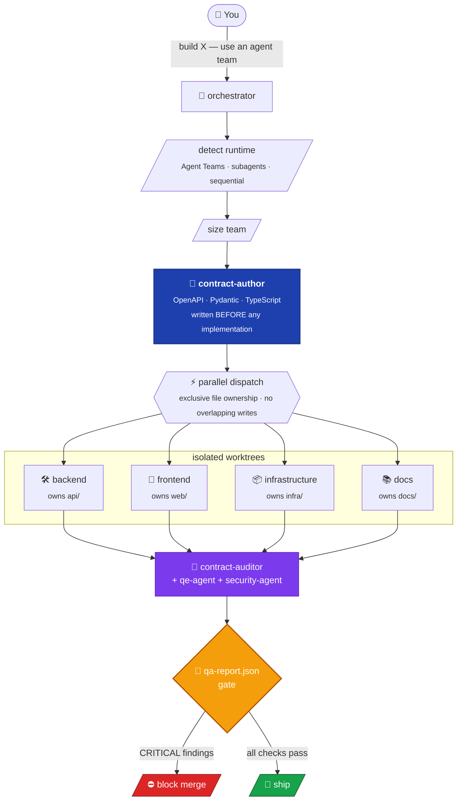

<div align="center">

# 🧰 Skill Madness

### *All the skills, all the agents, all the chaos.*

**One agent in one context window can only build so much. The `orchestrator` decomposes a build into a 14-phase plan, authors machine-readable contracts *before* any code is written, dispatches role agents in parallel with exclusive file ownership, and blocks the merge on a structured QA report. The skill library it draws from is portable: author once in `SKILL.md`, install into eleven AI coding tools — Claude Code, Copilot, Cursor, Aider, Windsurf, OpenCode, Qwen, OpenClaw, Gemini CLI, Antigravity, Kimi.**

<p align="center">
  <a href="https://github.com/ivy00johns/Skill-Madness/actions/workflows/lint-skills.yml"></a>
  <a href="LICENSE"></a>
  
  
  
  
  
  
</p>

<p align="center">
  <a href="#quick-start">Quick Start</a> ·
  <a href="#why-this-exists">Why this exists</a> ·
  <a href="#architecture">Architecture</a> ·
  <a href="#skill-catalog">Skill catalog</a> ·
  <a href="#also-works-on-ten-other-hosts">Other hosts</a> ·
  <a href="#roadmap">Roadmap</a>
</p>

</div>

---

## ✨ Why this exists

Every AI coding tool ships the same trap: one agent, one context window, one set of files — fine for small projects, brittle for anything larger than a single context can hold. And every tool reinvents the same wheel — Cursor wants `.mdc`, Aider wants `CONVENTIONS.md`, Windsurf wants `.windsurfrules`, Claude Code wants `SKILL.md` — so any prompt library you build gets stranded on whichever host you wrote it for.

**Skill Madness fixes both ends.** The `orchestrator` skill decomposes a complex build into a 14-phase plan, makes integration surfaces machine-readable *before* anyone writes code, dispatches role agents in parallel with strict file ownership, and refuses to ship until a separate QE agent signs off via a structured report. And the skill library it draws from authors once in the canonical `SKILL.md` format — the same skills install into eleven different AI coding tools without copy-paste drift.

- 👑 **The orchestrator is the entry point** — a single 14-phase playbook covering team sizing, runtime detection, contract authoring, parallel dispatch, integration validation, QA gate, and handoff. It's the skill that turns a one-line ask into a coordinated multi-agent build.
- 📜 **Contract-first** — `contract-author` writes OpenAPI / AsyncAPI / Pydantic / TypeScript / JSON Schema *before* a line of implementation. `contract-auditor` verifies every shipped module against the spec. Agents can't drift; the contract is the truth.
- 🤖 **Ten role agents, exclusive ownership** — backend, frontend, infrastructure, QE, security, docs, observability, db-migration, performance, code-review. Each declares `owns.directories` / `owns.files` in its frontmatter. No two agents touch the same path. Conflicts get resolved before spawn, not after.
- 🛡️ **QA gate that blocks** — `qe-agent` emits a `qa-report.json` with critical / high / medium / low findings plus contract-conformance and security scores. The orchestrator gates the merge on the report. Agents can't self-declare "done."
- 🪜 **Progressive disclosure** — frontmatter (~100 tokens) always loaded, body loaded on trigger, references loaded on demand. A 47-skill library stays cheap to host.
- 🔁 **Two-runtime degradation** — Agent Teams (parallel tmux) → subagents (Task tool) → sequential. The orchestrator picks the highest mode the host supports; role skills work standalone in any of them.
- 🧰 **47 skills, six categories, all CI-linted** — orchestrator, roles, contracts, meta-skills (skill-writer, skill-explorer, skill-review, skill-update), git workflow conventions, and 26 cross-cutting workflow skills (plan-builder, repo-deep-dive, ui-brief, mermaid-charts, diagnose-loop, grill-me, …). Frontmatter, body length, and cross-skill ownership all gated on every push.
- 🌐 **Portable across eleven hosts** — `SKILL.md` is the canonical source; converters emit Claude Code, Copilot, Cursor, Aider, Windsurf, OpenCode, Qwen, OpenClaw, Gemini CLI, Antigravity, and Kimi formats. The orchestrator's parallel-dispatch metadata is Claude-Code-specific, but everything else (role definitions, contracts, workflows, git conventions, meta-skills) ports cleanly. See [Also works on ten other hosts](#-also-works-on-ten-other-hosts).

> **Status — read before you pitch this to anyone:**
> - **The orchestrator + 47-skill library is the mature part.** All bodies under 500 lines, zero ownership conflicts, zero broken cross-references, full Ubuntu + macOS lint matrix on every push.
> - **Claude Code is the end-to-end-verified host.** Multi-agent dispatch with file-ownership exclusivity and the `qa-report.json` gate runs live on Claude Code today. The other ten hosts receive skill *content* but don't run the orchestrator's parallel dispatch.
> - **Lossy conversion is announced.** When a skill is converted to a non-Claude-Code host, orchestration-only fields (`allowed_tools`, `owns`, `composes_with`, `spawned_by`, `requires_agent_teams`) are stripped with a stderr line per skill. Skills marked `requires_claude_code: true` are skipped entirely for those targets. See `contracts/installer/per-tool-output-spec.md`.

---

## 🚀 Quick Start

### Prerequisites

| You need | Why |
|----------|-----|
| **bash ≥4** + standard POSIX tools | The installer is pure shell |
| **python3** | Frontmatter parsing in `lint-skills.sh` |
| **git** | Cloning the repo and (optionally) symlinking into your global skills dir |
| **Claude Code** (recommended) | Where the orchestrator + multi-agent QA gate actually run end-to-end |
| **(optional) any of ten other hosts** | Copilot, Cursor, Aider, Windsurf, OpenCode, Qwen, OpenClaw, Gemini CLI, Antigravity, Kimi — see [Also works on ten other hosts](#-also-works-on-ten-other-hosts) |

### Install for Claude Code

Two install paths. Pick one.

#### Option A — Claude Code plugin manager (recommended for users)

From inside Claude Code:

```text
/plugin marketplace add ivy00johns/Skill-Madness
/plugin install skill-madness@skill-madness
```

That installs all 47 skills into Claude Code's plugin storage. No clone, no symlink, no edits-to-the-repo workflow. Use this if you just want the skills.

To update later: `/plugin update skill-madness`.

#### Option B — Clone + `/sync-skills` (recommended for contributors)

Clone, then run `/sync-skills` from inside Claude Code. It creates flattened symlinks at `~/.claude/skills/<skill-name>` so edits in the repo are live in every session — no rebuild step.

```bash
git clone https://github.com/ivy00johns/Skill-Madness.git
cd Skill-Madness

# Inside Claude Code:
/sync-skills
```

If you'd rather copy than symlink, the underlying script accepts `--copy` instead of `--link`. See `skills/workflows/sync-skills/SKILL.md`.

Use this if you want to author skills, iterate on them, or contribute upstream.

### Install for any of the other ten hosts

Two scripts. The first translates the canonical `SKILL.md` files into eleven host-native shapes; the second installs the converted artifacts into whichever hosts it detects on your machine.

```bash
./scripts/convert.sh   # skills/**/SKILL.md  →  integrations/<host>/...
./scripts/install.sh   # integrations/<host> →  ~/.<host>/, .cursor/rules/, etc.
```

`install.sh` is interactive when run in a TTY and auto-detects from environment variables in CI. See [Also works on ten other hosts](#-also-works-on-ten-other-hosts) for the per-host format matrix and what gets stripped on conversion, and `scripts/README.md` for flag-level docs.

### Use it

Tell Claude Code to build something with multiple agents:

```text
"Build a chat app with React frontend and FastAPI backend — use an agent team."
```

The `orchestrator` skill triggers automatically: it sizes the team, generates contracts, spawns parallel agents in isolated worktrees, gates the build on `qa-report.json`, and returns when QE signs off.

Or invoke any skill standalone:

```text
"Review this code for security vulnerabilities."   → security-agent
"Set up Docker and CI/CD for this project."        → infrastructure-agent
"Write k6 load tests for the /search endpoint."    → performance-agent
"Profile this codebase and write me a CLAUDE.md."  → project-profiler
"Generate a UI brief for a refresh of /settings."  → ui-brief
```

---

## 🧬 Architecture

The orchestrator sits above six skill categories — every build pulls from this library, every category lints clean, every category ports to all eleven hosts.

```mermaid
flowchart TB
    orch["👑 <b>orchestrator</b><br/><sub>14-phase build playbook · runtime detection<br/>team sizing · circuit breaker · handoff protocol</sub>"]:::entry

    subgraph contracts["📜 contracts/ — 2 skills"]
        direction TB
        ca[contract-author]
        cau[contract-auditor]
    end

    subgraph roles["🤖 roles/ — 10 agents · exclusive file ownership"]
        direction TB
        be[backend]
        fe[frontend]
        infra[infrastructure]
        qe["qe<br/><sub>(QA gate)</sub>"]:::gate
        sec[security]
        rdocs[docs]
        obs[observability]
        dbm[db-migration]
        perf[performance]
        cra[code-review]
    end

    subgraph meta["🧠 meta/ — 4 skills"]
        direction TB
        sw[skill-writer]
        sx[skill-explorer]
        sr[skill-review]
        su[skill-update]
    end

    subgraph gitcat["🔁 git/ — 4 skills"]
        direction TB
        gcm[git-commit]
        gpr[git-pr]
        gpf[git-pr-feedback]
        gpmc[git-post-merge-cleanup]
    end

    subgraph workflows["⚙️ workflows/ — 26 skills"]
        direction TB
        pb[plan-builder]
        cm[context-manager]
        dc[dependency-coordinator]
        dch[deployment-checklist]
        pp[project-profiler]
        wr[wiki-research]
        rdd[repo-deep-dive]
        lw[llm-wiki]
        ub[ui-brief]
        cdb[claude-design-brief]
        mc[mermaid-charts]
        rs[render-sanity]
        dl[diagnose-loop]
        more["+ 13 more"]
    end

    orch --> contracts
    orch --> roles
    orch --> meta
    orch --> gitcat
    orch --> workflows

    classDef entry fill:#7c3aed,stroke:#4c1d95,color:#fff,stroke-width:2px
    classDef gate fill:#dc2626,stroke:#7f1d1d,color:#fff,stroke-width:1.5px
```



### How a build flows

A one-line build request enters the orchestrator and exits as a shipped artifact only after the `qe-agent` writes a passing `qa-report.json`. Every other path blocks the merge.



---

## 🧰 Skill catalog

47 skills organized into six categories. All bodies under 500 lines, all frontmatter validated, zero ownership conflicts, zero broken cross-references.

<details>
<summary><b>📚 Full skill table</b> (click to expand)</summary>

| # | Skill | Category | What it does |
|---|-------|----------|--------------|
| 1 | `orchestrator` | coordinator | 14-phase multi-agent build playbook (the entry point) |
| 2 | `backend-agent` | role | API servers, business logic, data layers |
| 3 | `frontend-agent` | role | UI, client-side state, presentation |
| 4 | `infrastructure-agent` | role | Docker, CI/CD, deployment configs |
| 5 | `qe-agent` | role | Contract conformance, integration testing, QA gate report |
| 6 | `security-agent` | role | OWASP audits, dependency + auth review |
| 7 | `docs-agent` | role | READMEs, API docs, changelogs |
| 8 | `observability-agent` | role | Logging, metrics, health checks, alerting |
| 9 | `db-migration-agent` | role | Schema migrations, seed data |
| 10 | `performance-agent` | role | Load testing (k6 default; Locust / JMeter / Artillery) |
| 11 | `code-review-agent` | role | Orchestrator-dispatched code review with scoring rubric |
| 12 | `contract-author` | contract | Generates API / data / event contracts before any build |
| 13 | `contract-auditor` | contract | Verifies implementations match contracts (static audit) |
| 14 | `skill-writer` | meta | Generates new SKILL.md files with proper frontmatter |
| 15 | `skill-explorer` | meta | Discover, recall, and route across the skill toolkit |
| 16 | `skill-review` | meta | Bulk audit or single-skill deep review with scoring |
| 17 | `skill-update` | meta | Apply a skill-review report — edit, lint, ship |
| 18 | `git-commit` | git | Conventional commits + branch naming |
| 19 | `git-pr` | git | PR title/body format and gh CLI workflow |
| 20 | `git-pr-feedback` | git | Triage and address PR review comments |
| 21 | `git-post-merge-cleanup` | git | Prune merged branches, dead remote refs, stale worktrees |
| 22 | `plan-builder` | workflow | Research / PRDs → orchestrator-ready build plans |
| 23 | `context-manager` | workflow | Compaction strategy, handoffs, token budgets |
| 24 | `dependency-coordinator` | workflow | Cross-package dependency manifest before parallel dispatch |
| 25 | `deployment-checklist` | workflow | Pre-deploy verification gates |
| 26 | `project-profiler` | workflow | Codebase analysis → CLAUDE.md + profile.yaml |
| 27 | `wiki-research` | workflow | Wiki-first protocol — read 3 pages before crawling source |
| 28 | `setup-project-skills` | workflow | Bootstrap per-repo config that other Skill-Madness skills consume |
| 29 | `work-item-brief` | workflow | Durable, agent-ready ticket — no paths, just acceptance criteria |
| 30 | `maintain-context` | workflow | Keep CONTEXT.md glossary + ADR records up to date inline |
| 31 | `zoom-out` | workflow | Step back — which modules are touched, what am I missing |
| 32 | `grill-me` | workflow | Depth-first design interview — one question at a time |
| 33 | `diagnose-loop` | workflow | Build the fast feedback loop first, then debug |
| 34 | `architecture-rescue` | workflow | Find shallow modules + missing seams; deletion + two-adapter test |
| 35 | `caveman` | workflow | Ultra-compressed responses, ~75% token cut, full accuracy |
| 36 | `render-sanity` | workflow | "Tests pass but UI is broken" gate — click-through + stale-data scan |
| 37 | `sync-skills` | workflow | Symlink/copy skills to `~/.claude/skills/` and Cursor |
| 38 | `settings-consolidator` | workflow | Merge Claude Code permissions across projects |
| 39 | `repo-deep-dive` | workflow | OSS repo → 12–14 doc technical reference series |
| 40 | `llm-wiki` | workflow | Bootstrap + maintain LLM-powered knowledge bases |
| 41 | `interactive-doc` | workflow | Paired Obsidian `.md` + self-contained `.html` companion |
| 42 | `ui-brief` | workflow | Opinionated UI design briefs (greenfield + rebuild) |
| 43 | `claude-design-brief` | workflow | Paste-ready prompts for Claude Design mockup canvas |
| 44 | `mermaid-charts` | workflow | Expert-quality diagrams (15–30+ node systems) |
| 45 | `nano-banana` | workflow | Google Gemini Imagen image generation + batch ops |
| 46 | `playwright` | workflow | Browser-based E2E + screenshots with visible Chrome |
| 47 | `railway-deploy` | workflow | Deploy to Railway (Dockerfile, multi-service, GraphQL API) |

</details>

---

## 📂 Project structure

```
.
├── README.md                         # this file
├── CLAUDE.md                         # project guidance for Claude Code
├── AGENTS.md                         # shared instructions for AI agents
│
├── skills/                           # the canonical skill library (47)
│   ├── orchestrator/                 # 1 — entry point
│   ├── roles/                        # 10 — implementation agents
│   ├── contracts/                    # 2 — contract-author / contract-auditor
│   ├── meta/                         # 4 — skills that manage skills
│   ├── git/                          # 4 — git workflow conventions
│   └── workflows/                    # 26 — cross-cutting process skills
│
├── scripts/                          # multi-tool installer
│   ├── convert.sh                    # SKILL.md → 11 host-native formats
│   ├── install.sh                    # integrations/ → host install dirs
│   ├── lint-skills.sh                # frontmatter + cross-skill validation
│   ├── lib/                          # frontmatter / platform / slug / term helpers
│   └── README.md                     # per-host destinations and flags
│
├── integrations/                     # generated outputs (one dir per host)
│   ├── claude-code/  copilot/  cursor/  aider/  windsurf/
│   ├── opencode/  qwen/  openclaw/  gemini-cli/  antigravity/  kimi/
│
├── contracts/installer/              # installer specs
│   ├── skill-source-format.md        # canonical SKILL.md schema
│   ├── per-tool-output-spec.md       # per-host fidelity matrix
│   ├── install-locations.md          # where each host expects skills
│   └── lint-rules.md                 # what the linter enforces
│
├── tests/installer/                  # bats-core tests for convert/install/lint
└── .github/workflows/lint-skills.yml # Ubuntu + macOS CI matrix
```

---

## 🎁 Also works on ten other hosts

The orchestrator and the multi-agent QA gate are Claude-Code-native — that's the headline feature. But the canonical `SKILL.md` format is platform-agnostic, so the same skill *content* (everything except the orchestration metadata) ports cleanly to ten other AI coding tools. Two scripts handle it:

```bash
./scripts/convert.sh   # skills/**/SKILL.md  →  integrations/<host>/...
./scripts/install.sh   # integrations/<host> →  ~/.<host>/, .cursor/rules/, etc.
```

`install.sh` is interactive when run in a TTY and auto-detects from environment variables in CI. See `scripts/README.md` for per-host destinations, scopes, and flags.

| Host | Scope | Output format | Source strategy |
|------|-------|---------------|-----------------|
| 🟣 **Claude Code** | user | `SKILL.md` (passthrough) | direct symlink |
| 🐙 **GitHub Copilot** | user | `.md` (passthrough) | direct copy |
| 🌀 **Cursor** | project | `.mdc` with metadata | generated |
| 🤝 **Aider** | project | single `CONVENTIONS.md` | accumulated |
| 🪁 **Windsurf** | project | single `.windsurfrules` | accumulated |
| 🧱 **OpenCode** | project | `.md` with `mode` field | generated |
| 🧮 **Qwen Code** | project | `.md` with optional `tools` | generated |
| 🦾 **OpenClaw** | user | 3-file split (SOUL / AGENTS / IDENTITY) | generated |
| 💎 **Gemini CLI** | user | extension manifest + `SKILL.md` | generated |
| 🛰️  **Antigravity** | user | community-skill `SKILL.md` | generated |
| 🌙 **Kimi Code** | user | YAML config + `system.md` | generated |

**Lossy by design.** Claude-Code-specific orchestration fields (`allowed_tools`, `owns`, `composes_with`, `spawned_by`, `requires_agent_teams`) are stripped on conversion to the other ten hosts — those hosts don't run multi-agent dispatch with file-ownership exclusivity, so the metadata would be noise. You'll see one `[host] stripped allowed_tools/owns from <slug>` line per affected skill on stderr. Skills marked `requires_claude_code: true` are skipped entirely for non-Claude-Code targets.

> **Credit where it's due.** The eleven-host installer pattern, the `detect_<tool>()` probes, the interactive selection UI, the slug pipeline, and the OpenClaw soul/agents split are all adapted from [`msitarzewski/agency-agents`](https://github.com/msitarzewski/agency-agents) (MIT). Full attribution and the list of pieces that came across vs. were rewritten lives in [`ACKNOWLEDGMENTS.md`](ACKNOWLEDGMENTS.md). The orchestrator, role agents, contracts, QA gate, and the rest of the skill library are independent.

---

## 💻 CLI / scripts reference

<details>
<summary><b>📖 Full script reference</b> (click to expand)</summary>

### `scripts/convert.sh`

Reads `skills/**/SKILL.md` and writes host-specific artifacts to `integrations/<host>/`. Idempotent. Lossy-by-design — orchestration metadata is stripped per the per-tool spec, with stderr warnings on every strip.

```bash
./scripts/convert.sh                     # all hosts
./scripts/convert.sh --only cursor       # one host
./scripts/convert.sh --skip-claude-only  # drop requires_claude_code skills early
```

### `scripts/install.sh`

Reads `integrations/<host>/` and copies into the host's expected install location. Detects which hosts are present on the machine (presence of `~/.cursor`, `~/.config/aider`, etc.). Interactive when run in a TTY; auto-confirms in CI.

```bash
./scripts/install.sh                     # all detected hosts
./scripts/install.sh --only claude-code  # one host
./scripts/install.sh --dry-run           # show what would happen
```

### `scripts/lint-skills.sh`

Runs on every push to every branch (Ubuntu + macOS) via `.github/workflows/lint-skills.yml`. Validates:

- Frontmatter schema (required fields, valid `version` semver, kebab-case `name`)
- Body length under 500 lines
- Cross-skill invariants (no ownership conflicts in `owns.directories` / `owns.files`)
- Reference link integrity within each skill's `references/`

Outputs JUnit XML for GitHub Actions test results.

```bash
./scripts/lint-skills.sh                 # full lint
./scripts/lint-skills.sh --skill orchestrator  # one skill
```

### `/sync-skills` (Claude Code slash command)

The recommended path on Claude Code. Symlinks `skills/<category>/<skill>/` to `~/.claude/skills/<skill>/` so Claude Code sees them globally and edits stay live.

</details>

---

## 🪝 Hooks

Skill Madness ships a small **hooks layer** under `hooks/` that turns the orchestrator's doctrine — the QA gate, formatting, profile injection — into enforcement. Hooks are modeled on the gated-hook design but built in the repo's own bash + `python3` (stdlib-only) idiom. Today only **Claude Code** has a native lifecycle-hook runtime, so hooks are emitted for Claude Code and skipped (logged `unsupported`) for the other ten hosts.

### The four hooks

| Hook | Event | Profiles | Blocks? | What it does |
|------|-------|----------|---------|--------------|
| `qa-gate` | `Stop` | all | **yes** | Validates `qa-report.json` against the QE schema and applies the orchestrator gate rules; blocks the Stop on a gate failure. **(marquee)** |
| `post-edit-format` | `PostToolUse(Edit\|Write)` | standard, strict | no | Formats the just-edited file if a matching formatter (prettier/black/shfmt/gofmt/rustfmt) is on `PATH`. |
| `session-start-profile` | `SessionStart` | standard, strict | no | Injects a ≤8 KB summary of `CLAUDE.md` / `.claude/profile.yaml` into the session. |
| `pre-commit-lint` | `PreToolUse(Bash git commit)` | strict | no (warn) | Runs `lint-skills.sh` on staged skills and warns; never blocks the commit. |

Everything routes through one entrypoint — `hooks/run-with-flags.sh <hook-id>` — which reads the gating env vars and `hooks.manifest.json`, then dispatches `hooks/scripts/<hook-id>.sh` (or no-ops `exit 0` if disabled).

### Profiles & disabling

Two env vars tune the whole graph:

- `ATS_HOOK_PROFILE` ∈ `{minimal, standard, strict}` (default `standard`).
  - `minimal` → `qa-gate` only.
  - `standard` → `qa-gate` + `post-edit-format` + `session-start-profile`.
  - `strict` → all four; `qa-gate` also treats a **missing** report as a block.
- `ATS_DISABLED_HOOKS` → comma-separated hook ids to force-off, e.g. `post-edit-format,pre-commit-lint`.

Only `qa-gate` ever blocks, and only on a real gate failure. It signals a block the Claude Code way — printing `{"decision":"block","reason":"…"}` to stdout and exiting `0`.

### Install & enable

`scripts/convert.sh --tool claude-code` copies `hooks/` into `integrations/claude-code/hooks/` and generates `integrations/claude-code/hooks.json` (Claude Code settings-hook format). `scripts/install.sh` then copies that tree to a **namespaced** target — `~/.claude/ats-hooks/` — and writes `hooks.json` there. Install is **non-destructive**: it never auto-merges your `~/.claude/settings.json`. Instead it prints the exact snippet to merge into the `"hooks"` key. The wrapper is invoked as:

```text
"$CLAUDE_PROJECT_DIR"/.claude/ats-hooks/run-with-flags.sh <hook-id>
```

### Lint & test

```bash
./scripts/lint-hooks.sh          # validate the hooks tree (manifest, exec bits, headers, profiles)
bash tests/hooks/run-tests.sh    # the bats suite (wrapper gating, qa-gate, convert, lint)
```

Both run in CI via the `Hooks Layer (Ubuntu)` job in `.github/workflows/lint-skills.yml`.

---

## 🛠️  Development

### Run the lint locally

```bash
./scripts/lint-skills.sh
```

That's the same command CI runs. If it's green locally on macOS or Linux, the PR will be green.

### Add a new skill

1. Use the `skill-writer` skill: `"Generate a new skill for X."` — it scaffolds frontmatter + body in the right category dir.
2. Or copy `skills/meta/skill-writer/references/skill-template.md` and fill in by hand.
3. Run `./scripts/lint-skills.sh --skill <your-skill>` until clean.
4. Run `/sync-skills` (or `./scripts/install.sh --only claude-code`) so Claude Code picks it up.
5. PR — CI gates on full-ecosystem lint.

### Edit an existing skill

If you used `/sync-skills`, the symlinks make edits in `skills/` live in `~/.claude/skills/` immediately — no resync needed.

> **Keep skill bodies under 500 lines.** When detail spills over, move it to `references/` — that's what progressive disclosure is for.

---

## 🩺 Troubleshooting

<details>
<summary><b>"<code>/sync-skills</code> says skills already exist"</b></summary>

Existing files in `~/.claude/skills/<name>/` block the symlink. Either delete the existing dir or run with `--force` to overwrite. The `sync-skills` skill body documents the safe paths.
</details>

<details>
<summary><b>"Linter fails on macOS but passes on Linux (or vice versa)"</b></summary>

Almost always a `pyyaml` version skew. CI installs `pyyaml` explicitly on macOS — replicate locally with `python3 -m pip install pyyaml`. Linux runners include it preinstalled.
</details>

<details>
<summary><b>"My non-Claude-Code host doesn't see all 47 skills"</b></summary>

Expected. Skills with `requires_claude_code: true` (notably the `orchestrator` and most of `roles/`) are skipped for hosts that can't execute multi-agent dispatch. Run `./scripts/convert.sh --verbose` to see the skip list per host.
</details>

<details>
<summary><b>"Stderr is full of <code>stripped allowed_tools/owns</code> lines"</b></summary>

That's by design — every Claude-Code-only frontmatter field that gets stripped on conversion to another host is announced. It's not an error; it's the installer being honest. Pipe stderr to a log file if it's noisy: `./scripts/convert.sh 2> convert.log`.
</details>

<details>
<summary><b>"Orchestrator complains about file-ownership conflicts"</b></summary>

Two skills declare `owns.directories` or `owns.files` on overlapping paths. The lint output prints the offending pair — open both SKILL.md files and pick which one truly owns it. The orchestrator's canonical ownership map (in `skills/orchestrator/SKILL.md`) is the tiebreaker.
</details>

<details>
<summary><b>"<code>install.sh</code> can't find my host's install directory"</b></summary>

Set the override env var documented in `scripts/README.md` (e.g. `CURSOR_RULES_DIR=...`, `AIDER_CONVENTIONS_PATH=...`) before running. The defaults assume each host's standard location.
</details>

---

## 🗺️  Roadmap

- [x] **Skill library** — 47 skills, six categories, all linted
- [x] **Multi-tool installer** — convert / install / lint, eleven host adapters
- [x] **CI matrix** — Ubuntu + macOS lint on every push
- [x] **Contract-first specs** — OpenAPI / AsyncAPI / Pydantic / TypeScript / JSON Schema templates
- [x] **QA gate** — `qa-report.json` schema with critical / high / medium / low blockers
- [x] **Two-runtime degradation** — Agent Teams → subagents → sequential, host-detected
- [ ] **Image assets** — README hero, architecture diagram, host matrix illustration ⏳
- [ ] **End-to-end multi-agent verification on non-Claude-Code hosts** ⏳
- [ ] **Skill marketplace / registry** — discoverable installs, version pinning ⏳
- [ ] **Per-host CI smoke tests** — actually exercise each adapter's converted skills against a sample host ⏳

---

## 🧭 Key design decisions

- 📜 **One canonical format** — `SKILL.md` with YAML frontmatter is the source of truth; everything else is generated.
- 🚫 **Exclusive file ownership** — no two role agents own the same file. Conflicts resolved before spawn, not after.
- 🚦 **QA gate blocks** — critical issues or sub-threshold contract / security scores in `qa-report.json` fail the build. Self-declared "done" is not accepted.
- 🪜 **Progressive disclosure** — frontmatter (always loaded) → body (loaded on trigger) → references (loaded on demand). Big libraries, small contexts.
- 🪞 **Lossy conversion is announced** — every stripped field gets a stderr line per skill per host. The installer never silently drops content.
- 🛡️ **Fail loud, fail early** — frontmatter schema, ownership conflicts, broken cross-refs are all CI errors, not warnings.
- 🔁 **Symlinks > copies** — `/sync-skills` defaults to symlinking so edits in the repo are instantly live in every Claude Code session.
- 📣 **Pushy descriptions** — skill `description` fields intentionally over-enumerate trigger contexts. Under-triggering is a worse failure than over-triggering.

---

## 🤝 Contributing

PRs welcome — new skills, host adapter improvements, lint rules, examples, bug reports.

- New skill? Use `skill-writer` to scaffold it, then run `./scripts/lint-skills.sh` until clean.
- New host adapter? Add the converter to `scripts/convert.sh`, the installer destination to `scripts/install.sh`, and a fidelity row to `contracts/installer/per-tool-output-spec.md`.
- Bug report? Include the failing skill name and the lint output verbatim.

---

## 📜 License & attribution

[MIT](LICENSE) — fork, embed, ship commercial products on top, just keep the notice.

The multi-tool installer (`scripts/convert.sh`, `scripts/install.sh`, `scripts/lib/`) adapts code from [`msitarzewski/agency-agents`](https://github.com/msitarzewski/agency-agents) (also MIT). Full credits, the list of adapted pieces, and the upstream MIT notice live in [`ACKNOWLEDGMENTS.md`](ACKNOWLEDGMENTS.md).

---

<div align="center">

### ⭐ Star History

<a href="https://star-history.com/#ivy00johns/Skill-Madness&Date">
  
</a>

<br/><br/>

<sub>🧰 Built by humans + the agents they coordinate.</sub>

</div>
