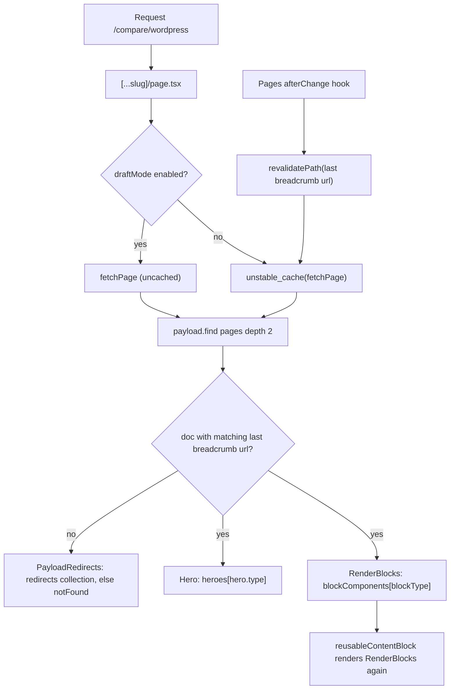

# payloadcms.com anatomy

How the official Payload website is built, from reading its open-source repo and checking the live site. Use it to reproduce a site of this shape on Payload, or to borrow its patterns.

- Repo: `payloadcms/website`, read at commit `023c2a5` (2026-09-23). Runs `payload` and `@payloadcms/*` 3.90.1, Next.js 16.3.3, React 19.2.3, TypeScript 5.7.3, MongoDB via `@payloadcms/db-mongodb`, SCSS Modules.
- Live checks: made 2026-09-24 against https://payloadcms.com with curl and Playwright. Every live claim below says so.
- Label rule: anything not read in the repo or seen live is marked `UNVERIFIED:`.

## Contents

1. License and what the repo does NOT contain
2. Repo map
3. Data model (collections, globals, blocks)
4. Route to collection to blocks
5. Render pipeline
6. Caching, revalidation, draft preview
7. Docs pipeline (GitHub markdown to Lexical)
8. Styling and design system
9. Integrations and services
10. Build, deploy, environment
11. Findings a cloner must know (bugs and unsafe patterns)
12. Copy vs replace

## 1. License and what the repo does NOT contain

> Verified against website repo @ 023c2a5 (`LICENSE`, `README.md`, `media/`, `src/fonts/`)

- `LICENSE` is the MIT License, "Copyright (c) 2023 Payload". It permits use, copying, modification, merging, publication, distribution, sublicensing and sale, provided the copyright and permission notice stay in all copies or substantial portions. README states the same ("available as open source under the terms of the MIT license"). Nothing else in the repo restricts the code.
- MIT covers the code the copyright holder wrote. The repo has no separate license file for the typeface, logos or images. `src/fonts/` holds ten `UntitledSans-*.woff2` files and no license text. `UNVERIFIED:` the redistribution terms for Untitled Sans; check the typeface vendor's license before shipping those files in a fork.
- Payload logos, marketing copy, customer logos and case-study text are CMS content, not repo content. Do not ship them in a clone.
- The repo contains no content export. `media/` holds two webp files (88K). Page, post, case-study and partner content lives only in the production database. What you can read without credentials is the published subset through the public REST API (section 4).
- `.env.example` lists every variable but no values. Several integrations (Payload Cloud, Discord, Stripe, HubSpot, Algolia, GA4) are specific to Payload's business; a clone needs none of them.

## 2. Repo map

> Verified against website repo @ 023c2a5 (`src/`, `package.json`, `pnpm-workspace.yaml`)

```text
src/payload.config.ts        single config: 55 config-level block entries, 15 collections, 5 globals, plugins
src/collections/             Pages, Posts, Categories, CaseStudies, Partners (+4 filter collections),
                             ReusableContent, Media, Users, Docs, DocsFeedback, CommunityHelp
src/globals/                 MainMenu, Footer, TopBar, GetStarted, PartnerProgram
src/blocks/<Name>/index.ts   block CONFIG (schema) - 30 dirs
src/components/blocks/<Name> block RENDERER (React) - 30 dirs
src/components/Hero/<Type>   hero renderers (9)
src/components/RenderBlocks  blockType -> component map + spacing logic
src/fields/                  shared fields: hero, link, linkGroup, slug, blockFields, richText, codeBlips
src/app/(frontend)/(pages)   marketing site routes
src/app/(frontend)/(cloud)   Payload Cloud product UI (irrelevant to a marketing clone)
src/app/(frontend)/api       preview, exit-preview, revalidate, og, sync-*, star-count
src/app/(payload)            admin + REST + GraphQL routes (standard Payload template)
src/app/_data/index.ts       all Local API fetchers used by pages (fetchPage, fetchPosts, ...)
src/css/                     app.scss, colors, theme, type, grid, vars, queries
src/scripts/                 docs fetch/sync, LLM file generation, Algolia sync, release-post tooling
src/proxy.ts                 Next 16 proxy (renamed middleware); analytics only
preview-runtimes/{v3,v4}     workspace packages that render Payload UI components inside docs
```

- One Next.js app hosts both the CMS admin and the frontend. `/admin` and `/api/*` are served on the same origin (live: `GET /admin` returns 200 HTML, `GET /api/pages?...` returns JSON).
- tsconfig maps `@blocks/*` to `src/components/blocks/*` (renderers) and `@root/*` to `src/*`. `next.config.js` aliases `@blocks` to `src/blocks` (configs). `UNVERIFIED:` which mapping wins at bundle time; keep both files consistent in a clone.
- Build uses `next dev --webpack` and `next build --webpack` although `next.config.js` also carries a `turbopack.resolveAlias` block.

## 3. Data model

> Verified against website repo @ 023c2a5 (`src/collections/*`, `src/globals/*`, `src/blocks/*`, `src/fields/*`)

### Collections

| Slug | Purpose | Notable fields / behavior |
|---|---|---|
| `pages` | Every marketing page | `title`, `fullTitle` (hook-computed), `noindex`, `hero` group, `layout` blocks (25 block refs), `slug` (`beforeValidate` slugify, indexed); `versions.drafts`; nested-docs adds `parent` and `breadcrumbs`; SEO adds `meta`; `read: publishedOnly` |
| `posts` | Blog, guides, releases | `title`, `featuredMedia` (upload or video URL), `image`, `videoUrl`, `thumbnail`, `category` -> `categories`, `tags[]`, `excerpt` rich text, `content` blocks (6 refs), `relatedPosts`, `relatedDocs` -> `docs`, `authorType` team or guest, `authors` -> `users`, `guestAuthor`, `guestSocials` group, `publishedOn`; drafts on |
| `categories` | Blog / Guides / Releases | `name`, `slug`, `headline`, `description`, `posts` as a `join` on `posts.category` (`defaultLimit: 0`) |
| `case-studies` | Customer stories | `title`, `introContent`, `industry`, `useCase`, `partner` -> `partners`, `featuredImage`, `layout` blocks (24 refs), `slug`, `url`; drafts on |
| `partners` | Agency directory | `name`, `website`, `email` (field access: admin read only), `slug`, `agency_status`, `hubspotID` (admin read only), `logo`, `featured` (read-only, managed from global), `topContributor`, tab `content` (banner, overview/services/idealProject rich text, `caseStudy`, `contributions[]`, `projects[]` max 4), tab details (`city`, `regions`/`specialties`/`budgets`/`industries` many-to-many, `social[]`); drafts on |
| `regions`, `specialties`, `industries`, `budgets` | Directory filters | `name` (unique), `value` (unique); all four generated by one `Filter(slug,label)` factory |
| `reusable-content` | Shared block stacks | `title`, `layout` blocks (28 refs); referenced by the `reusableContentBlock` block |
| `media` | Uploads | `alt` (required), `darkModeFallback` self-relationship upload |
| `users` | Team + cloud users | auth on, 8h token, `firstName`, `lastName`, `twitter`, `photo`, `roles` (`admin`/`public`, field-level access); `read: () => true` but `email` field read is admin-or-self |
| `docs` | Documentation pages | `content` Lexical, `title`, `description`, `keywords`, `headings` json, `path`, `topic`, `topicGroup`, `slug`, `label`, `order`, `version` (`v2`/`v3`/`v4`), hidden `mdx` textarea, `guides` join to posts in category `guides`; no drafts; `read: () => true` |
| `docs-feedback` | Helpful / not helpful votes | `path` (unique), `helpful`, `notHelpful`; endpoint `POST /api/docs-feedback/vote` |
| `community-help` | Mirrored Discord threads and GitHub discussions | `communityHelpType`, `githubID`, `discordID`, `communityHelpJSON`, `slug`, `helpful`, `relatedDocs`, `threadCreatedAt` |
| plugin-added | `forms`, `form-submissions`, `redirects` | `forms` and `form-submissions` come from form-builder, `redirects` from the redirects plugin. No search plugin is registered in `payload.config.ts`; search is Algolia. |

### Globals

| Slug | Fields |
|---|---|
| `main-menu` | `tabs[]`: `label`, `enableDirectLink` + `link`, `enableDropdown` + `description`, `descriptionLinks[]`, `navItems[]` with `style` default / featured / list and per-style groups |
| `footer` | `columns[]` (min 1, max 3), each with `label` and `navItems[]` |
| `topBar` | `enableTopBar`, `message` |
| `get-started` | tabbed content with sidebar links (SEO-enabled) |
| `partner-program` | `contactForm`, `hero`, `featuredPartners`, `contentBlocks` (`beforeDirectory`, `afterDirectory`) |

### Access model

- `access/isAdmin.ts`: `Boolean(user?.roles?.includes('admin'))`. Used for create/update/delete on nearly every collection.
- `access/publishedOnly.ts`: admins see everything; everyone else gets `{ _status: { equals: 'published' } }`. Applied as `read` on `pages`, `posts`, `case-studies` (they have drafts). `partners` uses `read: () => true` and filters in the fetcher.
- Field-level read restriction (`isAdminFieldLevel`) protects partner emails; `fetchPartners` passes `overrideAccess: false` so the Local API honors it.

### Block architecture (the site's core pattern)

- Blocks are registered once in the top-level `blocks: [...]` array of `buildConfig` and referenced by slug: `type: 'blocks', blockReferences: ['callout', 'cta', ...], blocks: []`. Config-level blocks keep the generated types and admin schema small when the same block appears in many collections.
- Almost every block wraps its fields in `blockFields({ name: '<blockName>Fields', fields })` (`src/fields/blockFields.ts`). That yields a group named `calloutFields`, `ctaFields`, ... with a collapsed `settings` group holding `theme` (`light`/`dark`, blank = system) and `background` (`solid`/`transparent`/`gradientUp`/`gradientDown`). Renderers find the group via `Object.keys(block).find(k => k.endsWith('Fields'))`. `DownloadBlock`, `ExampleTabs` and the small utility blocks do not use it.
- Live check: `GET /api/pages?where[slug][equals]=home&depth=0` returns `layout: [{ blockType: 'statement', statementFields: { settings: { theme: 'dark', background: 'transparent' }, ... } }, ...]`.

Marketing blocks (`src/blocks/*/index.ts`), with the fields that define each:

| blockType | Fields |
|---|---|
| `statement` | `richText`, `linkGroup`, `assetType` (media/code), `media`, `code`, `mediaWidth`, `backgroundGlow`, `assetCaption` |
| `stickyHighlights` | `highlights[]`: `richText`, `enableLink`+`link`, `type` (code/media), `code`+`codeBlips`, `media` |
| `cardGrid` | `richText`, `linkGroup`, `revealDescription`, `cards[]`: `title`, `description`, `enableLink`+`link` |
| `contentGrid` | `style` (gridBelow/sideBySide), `showNumbers`, `content`, `linkGroup`, `cells[]` (1-8 rich text) |
| `cta` | `style` (buttons/banner), `richText`, `commandLine`, `linkGroup` (+ npm CTA), `bannerLink`, `bannerImage`, `gradientBackground` |
| `mediaContent` | `alignment`, `mediaWidth`, `richText`, `enableLink`+`link`, `images[]` |
| `mediaBlock` | `position`, `media`, `caption` |
| `content` | `useLeadingHeader`, `leadingHeader`, `layout` (one / two / 2/3+1/3 / half / three columns), `columnOne`..`columnThree` |
| `codeFeature` | `forceDarkBackground`, `alignment`, `heading`, `richText`, `linkGroup`, `codeTabs[]` (`language`, `label`, `code`, `codeBlips`) |
| `callout` | `richText`, `logo`, `author`, `role`, `images[]` |
| `logoGrid` | `richText`, `enableLink`+`link`, `logos[]` |
| `hoverHighlights` | `beforeHighlights`, `highlights[]` (`text`, `media.top`, `media.bottom`, `link`), `afterHighlights`, `link` |
| `hoverCards` | `hideBackground`, `richText`, `cards[]` (max 4: `title`, `description`, `link`) |
| `steps` | `steps[]`: `content`, `media` |
| `mediaContentAccordion` | `alignment`, `leader`, `heading`, `accordion[]` (max 4: `position`, `background`, `mediaLabel`, `mediaDescription`, link, `media`) |
| `slider` | `introContent`, `linkGroup`, `quoteSlides[]` (min 3: `quote`, `author`, `role`, `logo`, link) |
| `pricing` | `plans[]` (max 4: `name`, `hasPrice`, `price` or `title`, `description`, link, `features[]`), `disclaimer` |
| `comparisonTable` | `introContent`, `style`, `header` (`tableTitle`, two column headers), `rows[]` (max 10: `feature`, two check+text pairs) |
| `linkGrid` | `linkGroup` |
| `form` | `richText`, `form` -> `forms` |
| `caseStudyCards` | `pixels`, `cards[]`: `richText`, `caseStudy` |
| `caseStudiesHighlight` | `richText`, `caseStudies` (many) |
| `caseStudyParallax` | `items[]` (exactly 4: `quote`, `author`, `logo`, `images[]`, `tabLabel`, `caseStudy`) |
| `reusableContentBlock` | `reusableContent` -> `reusable-content`, `customId` |
| `banner`, `blogContent`, `blogMarkdown`, `code` | Post-body blocks: alert banner, rich text, markdown field, code |

Hero (`src/fields/hero.ts`): a `hero` group with `type` (`default`, `contentMedia`, `centeredContent`, `form`, `home`, `homeNew`, `livestream`, `gradient`, `three`) plus type-conditional fields (`richText`, `description`, `primaryButtons`, `media`, `images[]`, `logos[]`, `form`, `newsletter`, announcement link, breadcrumbs bar). Shared `link` field: `type` (internal reference to `pages`/`posts`/`case-studies`, or custom URL), `newTab`, `label`, `customId`, optional appearance.

Live census (public API, 44 published pages, 2026-09-24):

- Hero types: `gradient` 20, `centeredContent` 12, `form` 4, `contentMedia` 4, and one each of `homeNew`, `three`, `livestream`, `default`.
- Block use (uses / pages): `reusableContentBlock` 51/28, `stickyHighlights` 24/24, `statement` 18/14, `cardGrid` 15/15, `contentGrid` 10/9, `cta` 8/7, `mediaContent` 7/5, `mediaBlock` 6/6, `content` 5/5, `codeFeature` 4/2, `logoGrid` 3/3, `hoverHighlights` 3/3, `callout` 3/3, `steps` 2/2, `mediaContentAccordion` 2/2, one each of `comparisonTable`, `slider`, `form`, `pricing`, `linkGrid`, `caseStudyCards`. `exampleTabs`, `caseStudiesHighlight`, `caseStudyParallax` and `hoverCards` appear on zero published pages (the census did not cover blocks nested inside `reusable-content` or `case-studies` documents).
- 18 of 44 pages have a `parent` (nested-docs), e.g. `/compare/wordpress`, `/enterprise/single-sign-on-sso`, `/use-cases/headless-cms`.

## 4. Route to collection to blocks

> Verified against website repo @ 023c2a5 (`src/app/(frontend)/(pages)/**`, `redirects.js`, `src/app/_data/index.ts`) and live 2026-09-24

| URL | Source | Rendered by |
|---|---|---|
| `/`, any other CMS page (`/developers`, `/compare/wordpress`, `/get-started`, `/case-studies`, ...) | `pages` | `(pages)/[...slug]/page.tsx`: `Hero` + `RenderBlocks`; `/` re-exports the same component with `slug` undefined so `fetchPage` falls back to `['home']` |
| `/posts/[category]` | `categories` + join `posts` | `Archive` (live: `/posts/blog`, `/posts/guides`, `/posts/releases`; all posts on one page, no pagination component) |
| `/posts/[category]/[slug]` | `posts` | `Post` component; body is `RenderBlocks` over `content` plus a synthetic `relatedPosts` block that `Post` appends at render time (that `blockType` exists in the renderer map but not in any config) |
| `/blog`, `/blog/:slug` | static redirects in `redirects.js` to `/posts/blog...` (live: `/blog` lands on `/posts/blog`) | n/a |
| `/case-studies/[slug]` | `case-studies` | `case-studies/[slug]/client_page.tsx` |
| `/partners`, `/partners/[slug]` | `partners`, `partner-program` global, filter collections | `PartnerDirectory` (client-side AND-filtering of up to 300 rows), `PartnerGrid`, `RenderBlocks` for before/after blocks |
| `/docs/[topic]/[doc]` | `docs` where `version = v3` | `RenderDocs` |
| `/docs/beta/...`, `/docs/v2/...` | `docs` where `version = v4` / `v2` | same, behind env flags for the selector |
| `/docs/dynamic/...`, `/docs/local/...`, `/docs/local/v4/...` | GitHub on demand / local markdown | authoring previews, no DB write |
| `/community-help`, `/community-help/(discord|github)/[slug]` | `community-help` | thread pages |
| `/styleguide/**` | code only | living styleguide: blocks, buttons, cards, fields, forms, heros, icons, typography |
| `/cloud/**`, `/login`, `/new/**` | Payload Cloud API | product UI, not a marketing concern |
| `/admin`, `/api/[...slug]`, `/api/graphql*` | Payload | standard `(payload)` route group |

- `generateStaticParams` for pages builds from `fetchPages` (limit 300, `select: { breadcrumbs }`, published only, excludes slug `cloud`), so nested pages are prebuilt at their breadcrumb URLs.
- `fetchPage` queries by the LAST path segment as `slug`, then picks the doc whose last `breadcrumbs[].url` equals the full requested path. Two nested pages may therefore share a slug under different parents.
- Live pricing page is `/get-started` (a `pricing` block), not `/pricing`.
- Live examples, layout arrays read from the API: `/developers` = `gradient` hero + statement, mediaBlock, contentGrid, callout, codeFeature x3, cardGrid, statement, cta. `/get-started` = centeredContent hero + pricing, contentGrid, cta. `/case-studies` = centeredContent hero + caseStudyCards. `/talk-to-us` = form hero + logoGrid, reusableContentBlock. Home = `homeNew` hero + statement, hoverHighlights, slider, mediaContentAccordion, statement.

## 5. Render pipeline

> Verified against website repo @ 023c2a5 (`(pages)/[...slug]/page.tsx`, `_data/index.ts`, `RenderBlocks/index.tsx`, `blocks/ReusableContent/index.tsx`, `Hero/index.tsx`, `Pages.ts`)



- `RenderBlocks` is a `'use client'` component. It computes each block's top/bottom padding from the theme of the neighbouring blocks (`small` if adjacent themes match, `large` if they differ) and passes `padding`, `marginAdjustment`, `hideBackground` to the renderer.
- Unknown `blockType` values render nothing. Live-relevant example: `exampleTabs` is registered in config and allowed on pages, case studies, reusable content and the partner-program global, but `blockComponents` has no `exampleTabs` entry, so it would silently disappear if used (zero live pages use it).
- `reusableContentBlock` only renders when the relationship is populated (`typeof reusableContent === 'object'`). `fetchPage` uses `depth: 2`; a depth-0 fetch would render nothing for these blocks.
- Structure lesson for reverse-engineering: do not infer blocks from the DOM. `/compare/wordpress` is `reusableContentBlock` x3 + `cta` + `stickyHighlights`; DOM class names showed `Callout` and `CardGrid` because reusable content inlines other blocks. Read `GET /api/pages?where[slug][equals]=<slug>&depth=0` instead.

## 6. Caching, revalidation, draft preview

> Verified against website repo @ 023c2a5 (`vercel.json`, `Pages.ts`, `Posts.ts`, `Categories.ts`, `hooks/revalidateRedirects.ts`, `api/preview`, `api/revalidate`, `RefreshRouterOnSave`) and live 2026-09-24

- Layout sets `export const dynamic = 'force-static'`. Page data goes through `unstable_cache(fn, [key])`; there are no per-document tags on pages, so freshness comes from `revalidatePath` inside collection `afterChange` hooks (only when `_status` is `published` or changed).
- Tag-based paths: redirects (`revalidateTag('redirects', { expire: 0 })` from the redirects plugin's `afterChange`), categories (`'archives'`), forms (`form-<title>`), and `GET /api/revalidate?collection=&slug=&secret=` -> `revalidateTag('<collection>_<slug>', { expire: 0 })`. The two-argument `revalidateTag` form is what this repo uses on Next 16.3.3.
- Posts revalidate the old and new category paths when a post moves category. Note `Posts.afterChange` calls `revalidatePath('/<category>/<slug>')` without the `/posts` prefix, while the archive hooks use `/posts/<category>`. `UNVERIFIED:` whether the missing prefix leaves post pages stale until the TTL; the live post page did serve.
- `vercel.json`: every route gets `Cache-Control: max-age=0, s-maxage=31536000, stale-while-revalidate` (1-year edge cache), `/api/*` gets `no-cache`. Live: homepage `x-vercel-cache: HIT`, `age: 103639`, `x-nextjs-prerender: 1`.
- Draft preview: `admin.preview` and `admin.livePreview.url` both call `formatPreviewURL(collection, doc, category)` -> `${NEXT_PUBLIC_SITE_URL}/api/preview?url=<path>&secret=<NEXT_PRIVATE_DRAFT_SECRET>`. The route checks the secret, calls `payload.auth({ headers })`, enables `draftMode()` for logged-in users, redirects to the path. `/api/exit-preview` disables it. `formatPagePath` maps collection to URL prefix (`posts` -> `/posts/<category>`, `case-studies` -> `/case-studies`, nested pages use the last breadcrumb URL).
- Live edit refresh: pages mount `RefreshRouteOnSave` from `@payloadcms/live-preview-react`, whose `refresh` calls `router.refresh()`. This is server-refresh-on-save, not the client `useLivePreview` hook.
- The preview secret travels in the URL query, so any admin sees it in the iframe `src`. Acceptable for admin-only use; do not log or share those URLs.

## 7. Docs pipeline (GitHub markdown to Lexical)

> Verified against website repo @ 023c2a5 (`scripts/fetchDocs.ts`, `scripts/syncDocs.ts`, `collections/Docs/*`, `RenderDocs`, `scripts/generateLLMs.ts`, `README.md`) and live 2026-09-24

1. Source of truth is `payloadcms/payload` `docs/*/*.mdx` on GitHub branches `2.x` (v2), `3.x` (v3), `main` (v4) (`branchForVersion.ts`).
2. `fetchDocs` walks the ordered topic list in `Docs/topicOrder.ts` (per version: groups Basics, Managing Data, Features, Ecosystem, Deployment; a new topic must be added there by hand, the file says so), reads each file via the GitHub contents API with `GITHUB_ACCESS_TOKEN`, parses front matter with `gray-matter` (`title`, `desc`/`description`, `keywords`, `label`, `order`), extracts headings (matches levels 1-3, stores level 2 or 3), and rewrites `(/docs/` links to relative `(../`.
3. `mdxToLexical` converts MDX to a Lexical editor state using a headless editor with the docs `BlocksFeature` (17 docs blocks: Banner, Code, CodeTabs, Card, CardGroup, ComponentPreview, LightDarkImage, PayloadMedia, Upload, RestExamples, Resource, TableWithDrawers, VideoDrawer, Pill, Arrow, BulletList, YouTube). The raw MDX is stored in a hidden `mdx` field next to the Lexical `content`.
4. The admin "Sync Docs" button calls `GET /api/sync/docs`. It syncs v4, v3, v2 sequentially, upserts each doc by `slug + topic + version`, then deletes every `docs` row whose id was not just created or updated.
5. Pages render with `RenderDocs` (sidebar from `fetchTopicsForSidebar`, previous/next by topic order, TOC from `headings`, related community threads, guides join, feedback widget) and the Lexical `RichText` serializer. `generateStaticParams` prebuilds every v3 doc unless `NEXT_PUBLIC_SKIP_BUILD_DOCS` is set.
6. Reverse direction: editing a doc in the admin and saving with `?commit=true` converts Lexical back to MDX (`lexicalToMDX`) and POSTs it to `COMMIT_DOCS_API_URL` (a separate `gh-commit` service) on a branch. `?branch=` on `afterRead` fetches a single doc live from that branch.
7. Machine-readable outputs: `pnpm generate:llms` (runs in `build`) writes `public/llms.txt`, `public/llms-full.txt`, and per-version `public/docs/{v3,v4}/llms.txt`, `llms-full.txt` and one `.md` file per doc (those two version dirs are git-ignored). Docs pages advertise `<link rel="alternate" type="text/markdown" href="/docs/v3/<topic>/<doc>.md">`.
- Live: `/docs/v3/getting-started/what-is-payload.md` returns 200 `text/markdown`; `/llms.txt` 32 KB; `/docs/v3/llms-full.txt` 1.9 MB; sidebar groups on the page match `topicOrder.v3`; the version selector is hidden (env flags off).
- CI: `.github/workflows/on-payload-release.yml` fires on `payload-release-event` (or manual dispatch), posts a Slack message asking someone to press "Sync Docs" in the admin (so the docs sync is manual, not automatic), fetches the latest GitHub release, and POSTs it to `/api/create-release-post` (guarded by the `x-release-secret` header check in `createReleasePost.ts`).

## 8. Styling and design system

> Verified against website repo @ 023c2a5 (`src/css/*`, `cssVariables.cjs`, `src/providers/*`, `src/app/(frontend)/fonts.ts`) and live 2026-09-24

- SCSS Modules per component (`index.module.scss` beside `index.tsx`), no Tailwind. Built class names keep the folder name (`HomeNew_heroWrapper__xxxx`), which makes live DOM traceable to `src/components/<Name>`.
- Tokens are CSS custom properties. `colors.scss` holds 134 `--color-*` declarations across the `base` (0-1000), `success`, `warning` and `error` scales. `theme.scss` maps them to `--theme-*` under `[data-theme='light'|'dark']`. Examples: `--color-success-500: rgb(0,127,174)`, `--color-warning-500: rgb(244,172,79)`, `--color-error-500: rgb(255,135,111)`.
- Layout tokens in `app.scss`: `:root { font-size: 20px; --base: 20px; --header-height: 90px; --top-bar-height: 3rem; --gutter-h: calc(50vw - 40rem); --block-spacing: 7rem; --new-block-spacing: 8rem; --default-border-width: 2px; --trans-default: 150ms; --column: calc((100vw - 2*gutter)/16) }`, stepped down at breakpoints (live at 1440px: `--base 16px`, `--header-height 76px`, `--block-spacing 5rem`, `--gutter-h 4rem`).
- Breakpoints: `cssVariables.cjs` s 768 / m 1024 / l 1440; `vars.scss` also defines xs 400, mh 1170, mp 1200, lm 1400, l 1600, xl 1920, 2xl 2250. A 16-column CSS grid (8 columns at mid and below) with `.cols-N`, `.cols-m-N` classes, plus `@faceless-ui/css-grid` (12/8/8 columns) provider for JS-driven layout.
- Type: local font Untitled Sans (weights 300-800 + italics, `--font-body`) and Geist Mono on every page; `payloadV4Inter` and `payloadV4RobotoMono` (`next/font/google`) are applied only by the `/docs/beta` and `/docs/local/v4` layouts. `type.scss` exposes mixins `jumbo`, `h1`-`h6`, `body`, `small`, `large-body`, `code`, `label`, `uppercaseLabel`.
- Provider stack (`providers/index.tsx`): cookies, auth, faceless-ui scroll/mouse/window info, theme preference, css-grid, computed CSS values, modal, page transition, header intersection observer.
- Theming: `ThemePreferenceProvider` sets `document.documentElement` `data-theme` inside a client `useEffect` from `localStorage['payload-theme']`, else `prefers-color-scheme`, else `light`. `app.scss` hides the page with `html { opacity: 0 }` until `data-theme` exists. Live raw HTML shows `<html lang="en">` with no `data-theme`, and Playwright shows `data-theme="light"`, `opacity 1` after hydration. So the README's "no first-load flickering" is implemented as hide-until-JS, not an inline blocking script; with JavaScript disabled `UNVERIFIED:` the page stays invisible.
- Per-block dark sections coexist with a light page theme (homepage: page `data-theme=light`, all six blocks themed dark).
- Motion: `framer-motion` 12.0.0-alpha.2 plus components `SplitAnimate`, `SpotlightAnimation`, `MediaParallax`, `LineDraw`, `PageTransition` and `Payload3D` (not audited; `package.json` has no `three` or `gsap` dependency).

## 9. Integrations and services

> Verified against website repo @ 023c2a5 (`payload.config.ts`, `.env.example`, `scripts/*`, `CMSForm`)

| Concern | Implementation |
|---|---|
| Database | `mongooseAdapter({ url: DATABASE_URI })` |
| Uploads | `@payloadcms/storage-vercel-blob` on `media`, enabled by `BLOB_STORAGE_ENABLED`, 1-year cache, custom `generateFileURL` from `BLOB_STORE_ID` |
| Email | `nodemailerAdapter` + `nodemailer-sendgrid` |
| Forms | `formBuilderPlugin`: `forms` gain `hubSpotFormID`, `customID`, `requireRecaptcha`; `form-submissions` gain a server-validated `recaptcha` field and an `afterChange` hook posting to HubSpot's forms API; `beforeChange` looks up a partner's email for routing. Front end `CMSForm` posts to `/api/form-submissions` with `hubspotCookie`, `pageUri`, `recaptcha` |
| SEO | `seoPlugin` on `case-studies`, `pages`, `posts`, global `get-started`, image from `media` |
| Nested pages | `nestedDocsPlugin` on `pages`, URL = joined slugs |
| Redirects | `redirectsPlugin` on `case-studies`, `pages`, `posts`; `afterChange` revalidates the `redirects` tag; `PayloadRedirects` component resolves them at render time |
| Search | Algolia DocSearch for docs; a separate Algolia index for community help (`syncToAlgolia`) |
| Analytics | Google Analytics in `<head>` and Tag Manager in `<body>` (root layout), `@zubricks/plugin-google-analytics` admin widgets, and `proxy.ts` calling `trackDocumentationRequest` for `/docs/*`, `/llms.txt`, `/llms-full.txt` (env: `GA4_AI_*`, `LLMS_ANALYTICS_ENABLED`) |
| OG images | `/api/og` edge route with `next/og` `ImageResponse` and bundled fonts; used by docs and video posts |
| Sitemap / robots | `next-sitemap` in `postbuild` (`generateRobotsTxt: true`); live `robots.txt` allows all and points at the sitemap; `X-Robots-Tag: noindex` is added unless `NEXT_PUBLIC_IS_LIVE` is set |
| Community help | Vercel cron `0 2 * * *` hits `/api/sync-ch` (Discord + GitHub fetch, dedupe, Algolia sync) |
| Custom plugin | `opsCounterPlugin` counts Local API ops and traces Mongo pool stats; site-specific diagnostics, skip it |
| Cloud product | Stripe, GitHub OAuth, cloud API: irrelevant to a marketing clone |

## 10. Build, deploy, environment

> Verified against website repo @ 023c2a5 (`package.json`, `.env.example`, `vercel.json`, `Caddyfile`, `mise.toml`, `next.config.js`)

- Scripts: `dev` runs `generate:preview-styles` then `next dev --webpack`; `build` runs `generate:preview-styles`, `generate:llms`, `payload migrate`, then `next build --webpack` (so a build needs DB access and a GitHub token); `build:skipDocs` skips `generate:llms` and `payload migrate`; `postbuild` runs `next-sitemap`; `generate:types` and `generate:importmap` wrap the `payload` CLI with `NODE_OPTIONS=--no-deprecation`.
- Tooling: pnpm workspace (root + `preview-runtimes/*`), Node 24 via `mise.toml`.
- Local hostname: the app must run at `local.payloadcms.com:3000` (hosts entry) for cookie and GitHub OAuth behaviour; `Caddyfile` proxies `payloadcms.localhost` to `:3000`.
- Headers: `X-Frame-Options: SAMEORIGIN`, `Content-Security-Policy: object-src 'none'; base-uri 'self'; form-action 'self';`. `images.remotePatterns` whitelists the CMS hosts, Discord/GitHub/YouTube image hosts and the blob host.
- Suggested minimum env for a marketing clone (inferred from which code paths read each variable): `DATABASE_URI`, `PAYLOAD_SECRET`, `NEXT_PUBLIC_SITE_URL`, `NEXT_PUBLIC_CMS_URL`, `NEXT_PRIVATE_DRAFT_SECRET`, `NEXT_PRIVATE_REVALIDATION_KEY`, optionally `BLOB_READ_WRITE_TOKEN` + `BLOB_STORAGE_ENABLED` + `BLOB_STORE_ID`, `SITEMAP_URL`, `NEXT_PUBLIC_IS_LIVE`. Everything else in `.env.example` (Algolia, Discord, Stripe, GitHub, GA4, HubSpot, reCAPTCHA, docs dirs, cloud vars) belongs to a specific integration.
- `preview-runtimes/{v3,v4}` exist so docs can render real Payload UI components at two major versions side by side; `generatePreviewStyles.mjs` scopes each version's admin CSS under `[data-payload-preview-version='v3'|'v4']` and `next.config.js` webpack swaps stray UI stylesheets for `empty.css`. It is only needed for docs sites that show live admin components.

## 11. Findings a cloner must know

> Verified against website repo @ 023c2a5 and live 2026-09-24. Code-level findings were NOT probed on the live site; some routes may be protected elsewhere (`UNVERIFIED:`).

1. Unguarded sync endpoints in code. `syncDocs` (`GET /api/sync/docs`), `refreshMdxToLexical`, `redeployWebsite`, and the Next routes `GET /api/sync-ch`, `GET /api/sync-algolia` contain no `req.user` or secret check; `proxy.ts` only does analytics, and `NEXT_PRIVATE_CRON_KEY` from `.env.example` is never read in `src`. Only `createReleasePost` (secret header) and `createReleasePostFromAdmin` (admin role) check auth. Guard every custom endpoint with `req.user?.roles?.includes('admin')` or a shared secret, and check `Authorization` for cron routes.
2. Destructive sync. After importing, `syncDocs` runs `payload.delete({ collection: 'docs', where: { id: { not_in: [...] } } })`. A partial or failed fetch that returns fewer docs deletes the rest.
3. Hardcoded `admin.autoLogin` (a dev account email and password committed in the repo) in `payload.config.ts` with no `NODE_ENV` gate and no `prefillOnly`. In Payload 3.90.2 (`packages/payload/src/auth/strategies/jwt.ts`) a request with no token is authenticated as that user if it exists; the docs (`docs/authentication/overview.mdx`) say to gate it behind an environment variable. Never copy this; use `process.env.NODE_ENV === 'development' ? { ..., prefillOnly: true } : false`. Whether the production DB contains that user is `UNVERIFIED:` and was deliberately not tested.
4. Broken OG URLs on case studies. `case-studies/[slug]/page.tsx` builds `${process.env.NEXT_PUBLIC_CMS_URL}${page.meta.image.url}`, prepending the site origin to an already-absolute blob URL. Live raw HTML for `/case-studies/microsoft` and `/case-studies/asics` has `og:image` = `https://payloadcms.comhttps//l4wlsi8vxy8hre4v.public.blob.vercel-storage.com/...jpg`. The blog post page uses the upload `url` directly and is correct. Use the upload URL as-is (it is absolute with cloud storage) and rely on `metadataBase` only for relative paths. The missing colon after `https` is `UNVERIFIED:` (cause not found in the repo).
5. Silent block drops (`exampleTabs`, see section 5) and null render of depth-0 reusable content.
6. `PayloadRedirects` builds `/blog/` with no slug when a redirect targets a `posts` document by ID string, and `/blog/<slug>` (not `/posts/<category>/<slug>`) when populated; the static `/blog/:slug` redirect then forwards it.
7. No JSON-LD on a live blog post (0 `application/ld+json` scripts on `/posts/blog/deploy-payload-onto-cloudflare-in-a-single-click`); add Article/Organization structured data in a clone.
8. Theme init is client-side (section 8): plan for a no-JS fallback if that matters.
9. Draft/preview secret is in the URL (section 6).

## 12. Copy vs replace

> Verified against website repo @ 023c2a5

Copy (MIT, generic, proven):
- `blockFields` + config-level `blocks` + `blockReferences` architecture, `RenderBlocks` with neighbour-aware spacing, `Hero` type switch, shared `link`/`linkGroup`/`slug` fields, `publishedOnly`/`isAdmin` access helpers.
- The preview/exit-preview/revalidate route trio and `formatPreviewURL`/`formatPagePath` helpers.
- The `pages` collection shape: drafts + nested-docs breadcrumbs + SEO + redirects, and the `fetchPage` last-segment-then-breadcrumb lookup.
- Categories with a `join` to posts for archives; the four-collection filter factory for a directory; client-side directory filtering for a few hundred rows.
- Token system (`--color-*` to `--theme-*` under `data-theme`), block-level `settings.theme` and `background`, per-component SCSS modules.
- LLM outputs (`llms.txt`, `llms-full.txt`, per-doc `.md` + `rel=alternate`) for any docs-heavy site.

Replace or drop:
- All brand assets, copy, customer logos, `og-image.jpg`, `fullLogo.png`, favicons, Untitled Sans (until its terms are checked).
- Payload Cloud (`(cloud)` routes, Stripe, GitHub OAuth, cloud API), Discord/GitHub community-help mirroring, Algolia indexes, HubSpot routing, `opsCounter`, `preview-runtimes`, docs sync/commit machinery (unless you publish docs from GitHub).
- Hardcoded `autoLogin`, unguarded sync/redeploy endpoints, the case-study OG builder, and any absolute `payloadcms.com` / `cms.payloadcms.com` references (`next.config.js` remotePatterns, `mergeOpenGraph`, `llms` origin, `robots`/sitemap defaults).
- The `payload migrate` step in `build`: keep it only if you use a database adapter with committed migrations.
